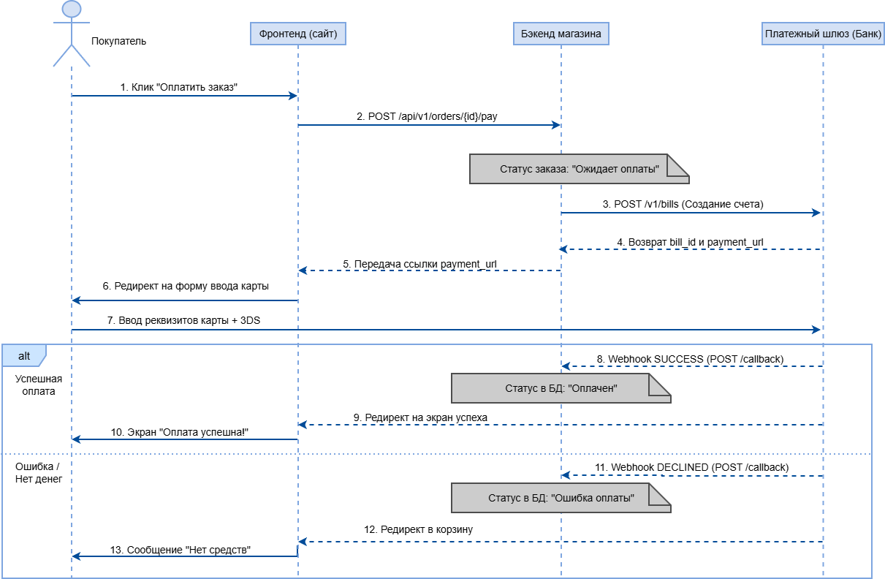

# Проектирование интеграции с платежным шлюзом для интернет-магазина

## 1. Бизнес-контекст и проблема
* **Контекст:** Интернет-магазин занимается продажей бытовой техники и электроники. Сейчас клиенты могут оплатить заказ только наличными или картой курьеру при получении.
* **Проблема:** По данным систем веб-аналитики, до 25% пользователей бросают корзину на этапе выбора способа доставки и оплаты. Опрос показал, что клиенты хотят оплачивать покупки сразу на сайте и не коммуницировать с курьерами. Бизнес теряет оборот и несёт лишние расходы на логистику из-за отмен.
* **Цель проекта:** Спроектировать интеграцию с внешним платежным шлюзом для автоматизации приема онлайн-платежей на сайте, повысить конверсию в покупку и снизить процент брошенных корзин.

## 2. Бизнес-процесс (BPMN 2.0 TO-BE)
*Ниже представлена целевая схема процесса онлайн-оплаты заказа на сайте:*


## 3. Техническое проектирование интеграции

### 3.1 Диаграмма последовательности (UML Sequence Diagram)
*Ниже представлена техническая диаграмма взаимодействия систем во времени с указанием REST API методов и эндпоинтов:*



### 3.2 Примеры API запросов и ответов (Спецификация API)

#### 1. Создание счета (Шаг 3: Бэкенд -> Банк)
* **Метод:** POST
* **Эндпоинт:** `/v1/bills`

**Тело запроса (Request):**
```json
{
  "amount": 49990.00,
  "currency": "RUB",
  "order_id": "ORD-2026-9912",
  "description": "Оплата заказа №9912 в интернет-магазине",
  "customer": {
    "email": "client@example.com",
    "phone": "+79991234455"
  }
}
```
**Ответ банка (Response 201 Created):**
```json
{
  "bill_id": "bill_abc123xyz",
  "status": "CREATED",
  "payment_url": "[https://securepay.bank.ru/pay/bill_abc123xyz](https://securepay.bank.ru/pay/bill_abc123xyz)",
  "created_at": "2026-07-19T11:00:00Z"
}
```

#### 2. Уведомление об оплате (Шаг 8: Банк -> Бэкенд через Webhook)
* **Метод:** POST
* **Эндпоинт:** `/api/v1/payment/callback`

**Тело уведомления при успехе (Webhook SUCCESS):**
```json
{
  "event": "payment.success",
  "bill_id": "bill_abc123xyz",
  "order_id": "ORD-2026-9912",
  "amount": 49990.00,
  "status": "SUCCESS",
  "payment_type": "CARD",
  "processed_at": "2026-07-19T11:02:15Z"
}
```

**Тело уведомления при ошибке (Webhook DECLINED):**
```json
{
  "event": "payment.failed",
  "bill_id": "bill_abc123xyz",
  "order_id": "ORD-2026-9912",
  "amount": 49990.00,
  "status": "DECLINED",
  "error": {
    "code": "INSUFFICIENT_FUNDS",
    "message": "Недостаточно средств на карте покупателя"
  },
  "processed_at": "2026-07-19T11:03:00Z"
}
```

## 4. Проектирование базы данных (SQL)

Для поддержки процесса онлайн-оплаты в базе данных интернет-магазина используются две основные таблицы: `orders` (заказы) и `payments` (транзакции). Связь между ними реализована как один-ко-многим (у одного заказа может быть несколько попыток оплаты, если первая завершилась ошибкой).

### 4.1 Структура таблиц (DDL)
```sql
-- Таблица заказов
CREATE TABLE orders (
    order_id VARCHAR(50) PRIMARY KEY,     -- Уникальный номер заказа (например, ORD-2026-9912)
    amount DECIMAL(10, 2) NOT NULL,       -- Сумма заказа
    currency VARCHAR(3) DEFAULT 'RUB',    -- Валюта
    status VARCHAR(20) NOT NULL,          -- Статус заказа ('PENDING', 'PAID', 'FAILED')
    customer_email VARCHAR(100),          -- Email клиента
    created_at TIMESTAMP DEFAULT NOW(),   -- Дата создания заказа
    updated_at TIMESTAMP DEFAULT NOW()    -- Дата обновления заказа
);

-- Таблица платежей (транзакций)
CREATE TABLE payments (
    payment_id SERIAL PRIMARY KEY,        -- Внутренний ID транзакции
    bill_id VARCHAR(100) UNIQUE,          -- ID счета из платежного шлюза (например, bill_abc123xyz)
    order_id VARCHAR(50) REFERENCES orders(order_id), -- Связь с таблицей заказов
    amount DECIMAL(10, 2) NOT NULL,       -- Сумма платежа
    status VARCHAR(20) NOT NULL,          -- Статус платежа ('CREATED', 'SUCCESS', 'DECLINED')
    payment_type VARCHAR(20),             -- Способ оплаты (CARD, SBP и т.д.)
    error_code VARCHAR(50),               -- Код ошибки при неудаче
    error_message TEXT,                   -- Текст ошибки для логов
    created_at TIMESTAMP DEFAULT NOW(),   -- Время инициации платежа
    processed_at TIMESTAMP                -- Время финальной обработки банком
);
```

### 4.2 Основные SQL-запросы (DML)

#### 1. Обновление статуса транзакции и заказа при успешной оплате (Webhook SUCCESS)

Когда от банка приходит успешный вебхук, бэкенд должен выполнить транзакцию из двух запросов:
```sql
-- Шаг A: Обновляем статус конкретного платежа
UPDATE payments 
SET status = 'SUCCESS', 
    payment_type = 'CARD',
    processed_at = '2026-07-19 11:02:15'
WHERE bill_id = 'bill_abc123xyz';

-- Шаг Б: Переводим сам заказ в статус "Оплачен"
UPDATE orders 
SET status = 'PAID', 
    updated_at = NOW()
WHERE order_id = 'ORD-2026-9912';
```

#### 2. Фиксация ошибки платежа (Webhook DECLINED)

Если платеж отклонен банком, мы меняем статус транзакции и записываем код ошибки, но сам заказ оставляем в статусе "Ожидает оплаты", чтобы пользователь мог попробовать еще раз:
```sql
UPDATE payments 
SET status = 'DECLINED',
    error_code = 'INSUFFICIENT_FUNDS',
    error_message = 'Недостаточно средств на карте покупателя',
    processed_at = '2026-07-19 11:03:00'
WHERE bill_id = 'bill_abc123xyz';
```
