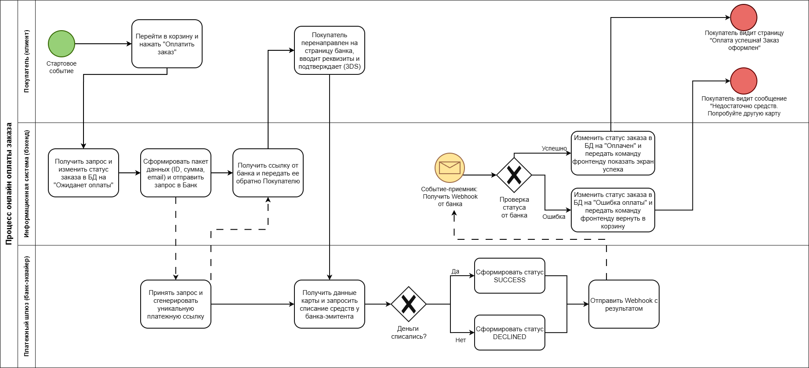

# Проектирование интеграции с платежным шлюзом для интернет-магазина

## 1. Бизнес-контекст и проблема
* **Контекст:** Интернет-магазин занимается продажей бытовой техники и электроники. Сейчас клиенты могут оплатить заказ только наличными или картой курьеру при получении.
* **Проблема:** По данным систем веб-аналитики, до 25% пользователей бросают корзину на этапе выбора способа доставки и оплаты. Опрос показал, что клиенты хотят оплачивать покупки сразу на сайте и не коммуницировать с курьерами. Бизнес теряет оборот и несёт лишние расходы на логистику из-за отмен.
* **Цель проекта:** Спроектировать интеграцию с внешним платежным шлюзом для автоматизации приема онлайн-платежей на сайте, повысить конверсию в покупку и снизить процент брошенных корзин.

## 2. Бизнес-процесс (BPMN 2.0 TO-BE)
*Ниже представлена целевая схема процесса онлайн-оплаты заказа на сайте:*



## 3. Техническое проектирование интеграции

### 3.1 Диаграмма последовательности (UML Sequence Diagram)
*Ниже представлена техническая диаграмма взаимодействия систем во времени с указанием REST API методов и эндпоинтов:*

```mermaid
%%{init: {'theme': 'neutral', 'themeVariables': { 'actorBkg':'#f9f9f9', 'actorBorder':'#333' }}}%%
sequenceDiagram
    autonumber
    actor User as Покупатель
    participant Front as Фронтенд (Сайт)
    participant Back as Бэкенд
    participant Bank as Платежный Шлюз

    User->>Front: Клик "Оплатить заказ"
    Front->>Back: POST /api/v1/orders/{id}/pay
    Note over Back: Статус: "Ожидает оплаты"
    Back->>Bank: POST /v1/bills (Создание счета)
    Bank-->>Back: bill_id, payment_url
    Back-->>Front: Передача payment_url
    Front->>User: Редирект на форму ввода карты
    User->>Bank: Ввод реквизитов + 3DS
    
    alt Успешная оплата
        Bank-->>Back: Webhook SUCCESS (POST /callback)
        Back->>Back: Статус БД: "Оплачен"
        Bank-->>Front: Редирект на экран успеха
        Front->>User: Экран "Оплата успешна!"
    else Ошибка / Нет денег
        Bank-->>Back: Webhook DECLINED (POST /callback)
        Back->>Back: Статус БД: "Ошибка оплаты"
        Bank-->>Front: Редирект в корзину
        Front->>User: Сообщение "Нет средств"
    end
