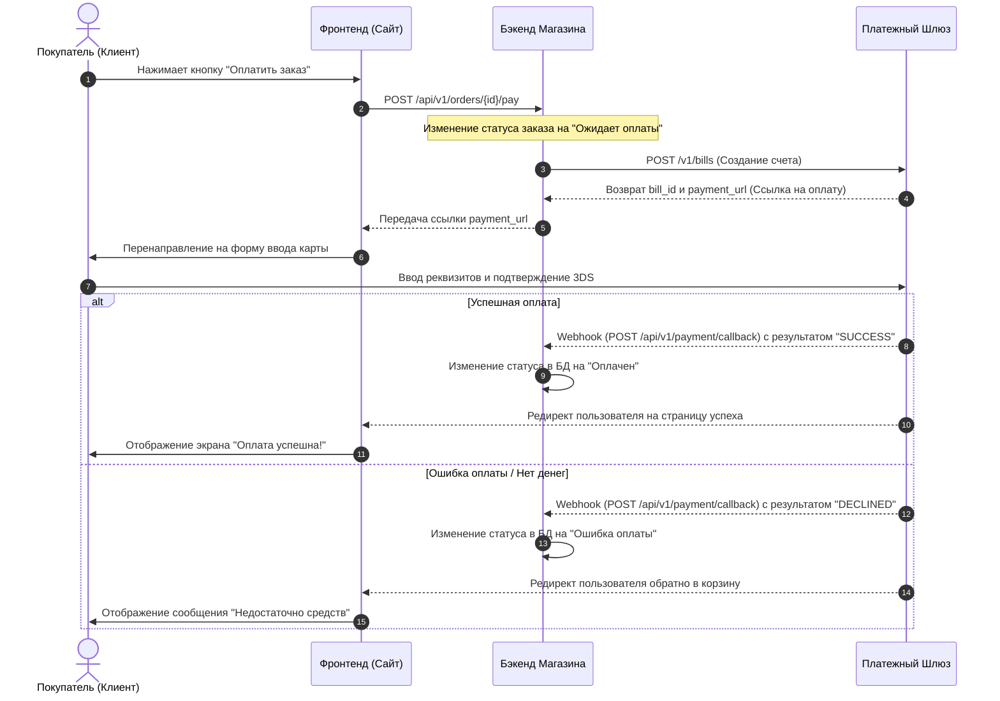

# Проектирование интеграции с платежным шлюзом для интернет-магазина

## 1. Бизнес-контекст и проблема
* **Контекст:** Интернет-магазин занимается продажей бытовой техники и электроники. Сейчас клиенты могут оплатить заказ только наличными или картой курьеру при получении.
* **Проблема:** По данным систем веб-аналитики, до 25% пользователей бросают корзину на этапе выбора способа доставки и оплаты. Опрос показал, что клиенты хотят оплачивать покупки сразу на сайте и не коммуницировать с курьерами. Бизнес теряет оборот и несёт лишние расходы на логистику из-за отмен.
* **Цель проекта:** Спроектировать интеграцию с внешним платежным шлюзом для автоматизации приема онлайн-платежей на сайте, повысить конверсию в покупку и снизить процент брошенных корзин.

## 2. Бизнес-процесс (BPMN 2.0 TO-BE)
*Ниже представлена целевая схема процесса онлайн-оплаты заказа на сайте:*

## 3. Техническое проектирование интеграции

### 3.1 Диаграмма последовательности (UML Sequence Diagram)
*Ниже представлена техническая диаграмма взаимодействия систем во времени с указанием REST API методов и эндпоинтов:*

